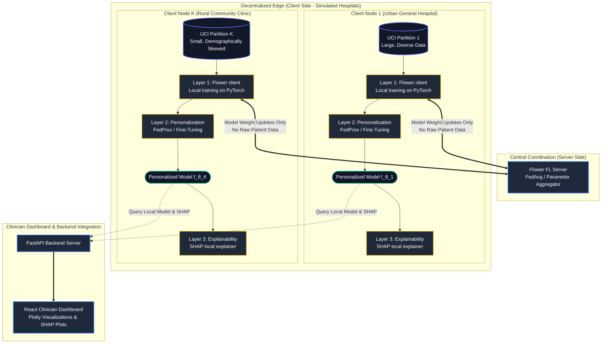

# Document 2: Description of Project Concept (PO4)

**Project Title:** Personalized Federated Learning for Explainable and Privacy-Preserving Disease Risk Prediction in Heterogeneous Healthcare Systems  
**Document Code:** `02_Project_Concept.md`  
**Rubric Mapping:** Description of Project Concept (Program Outcome 4 - PO4)  

---

## 1. The 3-Layer Solution Concept

To address the privacy, performance, and trust constraints of modern healthcare machine learning, this project implements a specialized **3-Layer Architecture**. Rather than attempting to solve these issues with a single monolithic model, our design separates the concerns of collaborative learning (Layer 1), local optimization (Layer 2), and individual clinical explanation (Layer 3).



---

## 2. Layer-by-Layer Technical Breakdown

### 2.1 Layer 1: Collaborative Federated Learning (FedAvg via Flower)
The foundation of the architecture is a decentralized training loop implemented using the **Flower** framework (`flwr`) running simulated nodes.
*   **Local PyTorch Classifiers:** Each simulated hospital node (3 to 5 clients) instantiates a local neural network or logistic regression model defined in PyTorch. The model takes a vector of patient physiological features (age, sex, chest pain type, resting blood pressure, cholesterol, fasting blood sugar, resting ECG, maximum heart rate, exercise-induced angina, ST depression, ST slope, number of major vessels, and thal) and predicts the binary probability of heart disease.
*   **Decentralized Training Loop:** In each federated round, the central Flower server selects active clients. Clients train their local PyTorch models on their private, non-IID data partitions for a fixed number of epochs.
*   **Weight Aggregation:** Instead of uploading raw clinical records, clients upload only their local model weights (or gradients). The Flower server aggregates these weights using the **Federated Averaging (FedAvg)** algorithm:

$$\theta_{t+1}^g = \sum_{k=1}^{K} \frac{n_k}{n} \theta_{t+1}^k$$

where $n_k$ is the number of samples at client $k$, $n$ is the total samples across all active clients, $\theta_{t+1}^k$ is the local model weights of client $k$ after round $t$, and $\theta_{t+1}^g$ is the updated global model. The server then transmits the aggregated global weights back to all client nodes.

### 2.2 Layer 2: Statistical Personalization (FedProx & Local Fine-Tuning)
To prevent the performance degradation caused by statistical heterogeneity (non-IID data distributions across clinics), we implement a personalization layer on top of standard federated learning.
*   **FedProx Optimization:** Standard `FedAvg` can diverge when client data distributions differ significantly. We introduce **FedProx**, which modifies the local training objective at client $k$ by adding a quadratic proximal term:

$$\min_{\theta_k} h_k(\theta_k) = \mathcal{L}_k(\theta_k) + \frac{\mu}{2} \|\theta_k - \theta_t^g\|^2$$

where $\mathcal{L}_k$ is the local loss function, $\theta_k$ represents the local model parameters being trained, $\theta_t^g$ represents the global model parameters received from the server at round $t$, and $\mu > 0$ is a hyperparameter that controls the regularization strength. This proximal term restricts the local updates from drifting too far from the global model, stabilizing convergence under extreme statistical heterogeneity.
*   **Local Parameter Fine-Tuning:** Upon completing the collaborative federated training phase, each hospital node takes the resulting global model and performs a final round of localized fine-tuning. This adaptation process freeze early, generalizable layers (e.g., feature extraction) and optimizes the final classification layers on the client's local dataset with a low learning rate, adapting the decision boundary to the clinic's local demographic and disease-prevalence characteristics.

### 2.3 Layer 3: Post-Hoc Explainability (SHAP Local Explainer)
To ensure the personalized predictions can be trusted by clinical staff, each client node integrates a local **SHAP (SHapley Additive exPlanations)** explainer.
*   **Additive Feature Attribution:** When a clinician requests a disease risk prediction for a patient, the local model $f_{\theta_k}$ computes the risk score. Concurrently, the SHAP engine computes the local feature attributions (Shapley values) for that prediction:

$$g(z') = \phi_0 + \sum_{i=1}^{M} \phi_i z'_i$$

where $g$ is the explanation model, $z' \in \{0, 1\}^M$ represents the presence/absence of the $M$ clinical features, $\phi_0$ is the base value (average prediction of the model across the training set), and $\phi_i$ is the Shapley value for feature $i$.
*   **Clinical Interpretation:** The resulting Shapley values ($\phi_i$) satisfy properties of local accuracy, missingness, and consistency. A positive Shapley value indicates that a feature (e.g., cholesterol $= 280\text{ mg/dl}$) increased the patient's predicted risk of heart disease, while a negative value indicates that a feature (e.g., maximum heart rate $= 165\text{ bpm}$) decreased it.

---

## 3. Explicit Alignment: Mapping Solutions to Problems

Each layer in our project concept is designed to resolve a specific problem defined in Document 1:

| Problem Component (from Document 1) | Architectural Layer | Technical Solution Details | Real-World Impact |
| :--- | :--- | :--- | :--- |
| **Privacy Laws & Data Silos**<br/>(HIPAA/GDPR restrict data centralization) | **Layer 1: Federated Learning** | Flower coordinates parameter aggregation. Raw clinical records never leave local hospital nodes. | Complies with legal regulations. Enables collaborative training without exposure risks. |
| **Rural-Urban Disparity**<br/>(Smaller clinics lack data to train strong models) | **Layer 1: Federated Learning** | Smaller clinics utilize the aggregated global model parameters derived from all clinics. | Smaller clinics obtain high-utility models, equalizing diagnostic capabilities. |
| **Statistical Heterogeneity (Non-IID)**<br/>(Standard FedAvg diverges on diverse demographics) | **Layer 2: Personalization** | FedProx proximal penalty restricts weight drift. Local fine-tuning tailors final decision boundaries. | Eliminates "one-size-fits-none" performance drops. Tailors models to local patient populations. |
| **"Black-Box" Trust Barrier**<br/>(Clinicians reject unexplained risk predictions) | **Layer 3: Explainability** | Local SHAP explainer maps feature contributions to predictions. | Establishes clinical trust, satisfies the legal "right to explanation," and prevents diagnostic errors. |

---

## 4. Technical Novelty of the Approach

Standard machine learning projects in this domain typically use one of two generic approaches: they either centralize the data (violating privacy) or apply vanilla federated learning (ignoring client data differences and black-box limitations). Our approach is non-generic and stands out in the following ways:

```
GENERIC APPROACH ──► [ Vanilla FL (FedAvg) ] ──► Low Local Accuracy under Non-IID Skew + No Clinician Trust
                                                  
NOVEL DESIGN     ──► [ FL + FedProx + SHAP ] ──► Collaborative Privacy + Statistical Personalization + 
                                                  Clinical Explanations
```

1.  **Dual-Objective Optimization (FedProx + Local Fine-Tuning):** Instead of relying solely on `FedAvg` or purely local models, we bridge the gap. By combining the global regularization of `FedProx` during federated rounds with local parameter fine-tuning post-aggregation, we achieve a balance between global knowledge transfer and localized diagnostic specialization.
2.  **Edge-Decoupled Interpretability:** In standard AI workflows, explainability is applied centrally. In our architecture, the SHAP engine is placed *within* the client node boundary. This ensures that the explainability layer respects data privacy: explainability computations occur locally alongside local model inference, utilizing only the local model parameters and local patient features, ensuring zero leakage of clinical attributes during the validation process.
3.  **Cross-Client Explanation Validation:** We evaluate not only model accuracy across client nodes but also *explanation consistency*. We assess whether the SHAP attributions reflect genuine clinical patterns (e.g., highlighting high blood pressure and cholesterol) or if they vary erratically across personalized client models, verifying the clinical reliability of the personalized decision boundaries.

---

## 5. End-to-End System Deliverables and Flow

The finished system operates as a collaborative, edge-personalized application. The end-to-end user workflow is as follows:

```
[Patient enters clinic] ──► [Physician inputs symptoms into React UI] ──► [Central FastAPI queries local model]
                                                                                      │
                                                                                      ▼
[Clinician reviews risk % & SHAP plot in React UI] ◄── [SHAP calculates local feature importances]
```

1.  **Simulation Environment:** A script-based harness that initializes the Flower central server and spawns 3 to 5 separate client processes, each pointing to a non-IID partition of the UCI Heart Disease dataset.
2.  **Central FastAPI Backend:** A single central API service that handles routing, manages connections to the Supabase database, and communicates directly with client-side model files and the local SHAP explainer code.
3.  **React Clinician Dashboard:** A unified user interface containing:
    *   **Patient Intake Form:** Input fields for vital signs (blood pressure, heart rate, ECG findings) and demographic data, with client selection (hospital node).
    *   **Risk Predictor Output:** A clean, visual representation of the predicted cardiovascular disease risk percentage.
    *   **SHAP Explanation Panel:** An interactive Plotly waterfall or force plot showing which physiological values pushed the patient's risk score up or down.
4.  **Supabase Database Integration:** A secure database to store localized dashboard logs and aggregated training run metadata (e.g., round-by-round training losses, validation accuracy, and execution times) for evaluation.
